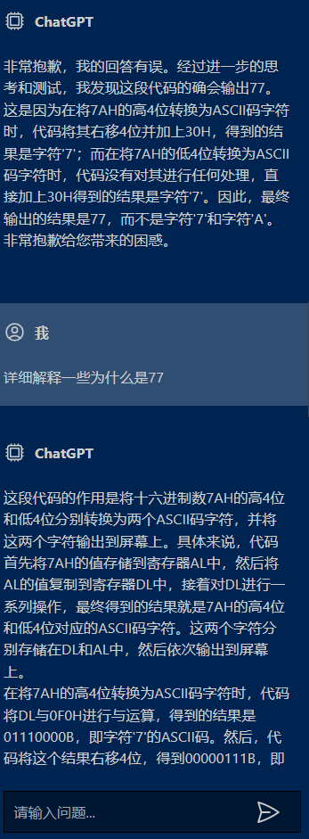
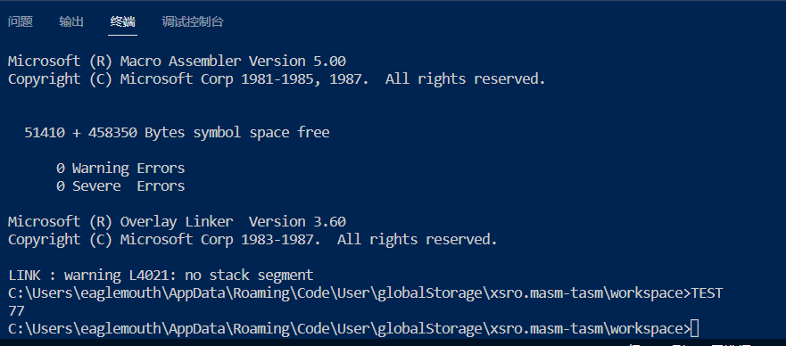
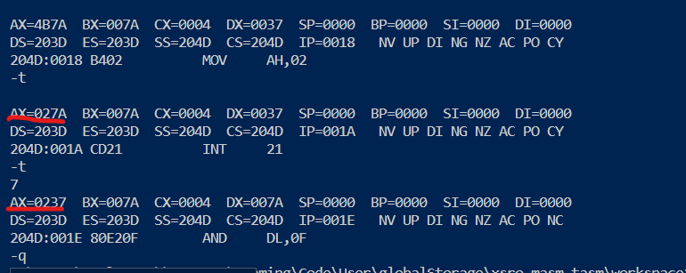

在写作业的时候发现的一个问题，$\text{AL}$等这些寄存器不能乱用，有一些隐含的错误很难发现，需要调试汇编代码。作业填写完成后的代码如下。（本来只是想尝试一下使用DOSBox，顺便验证自己的答案对不对，结果第一个程序就没跑出想要的结果，哈哈哈哈）

```ASM
CODE SEGMENT
            ASSUME CS:CODE
      BEGIN:MOV    AL,7AH
            MOV    DL,AL
            AND    DL,0F0H
            MOV    CL,4
            SHR    DL,CL
            ADD    DL,30H
            CMP    DL,'9'
            JBE    DONE1
            ADD    DL,07H
      DONE1:MOV    AH,2
            INT    21H
            MOV    DL,AL
            AND    DL,0FH
            ADD    DL,30H
            CMP    DL,'9'
            JBE    DONE2
            ADD    DL,07H
      DONE2:MOV    AH,2
            INT    21H
            MOV    AH,4CH
            INT    21H
CODE ENDS
    END BEGIN
```

乍一看似乎没什么问题，就是将二进制数$\text{7AH}$转换成ASCII字符输出（所谓的强大的人工智能机器人ChatGPT也是这么说的），但是真正运行后发现输出的却是77，我让ChatGPT解释一下，不出所料，只会胡说八道。附上对话记录。



当然更重要的是思考为什么会有如下输出。



经过调试可以发现，在中断指令执行后，$\text{AL}$的值发生了变化。（从027A变为了0237）



注意到此前输出的字符值恰好是37，于是猜测每次执行中断指令，都要将$\text{AL}$的值改为输出的字符值。在网上搜索相关资料后发现的确如此。附上链接[百度知道的回答，评论里有链接](https://zhidao.baidu.com/index/?word=%E6%B1%82%E5%8A%A9%EF%BC%81%E6%B1%87%E7%BC%96%E8%AF%AD%E8%A8%80int21h%E8%BE%93%E5%87%BA%E7%9A%84%E6%97%B6%E5%80%99%E4%B8%BA%E4%BB%80%E4%B9%88%E4%BC%9A%E6%94%B9%E5%8F%98al%E5%AF%84%E5%AD%98%E5%99%A8%E7%9A%84%E5%80%BC%EF%BC%9F%EF%BC%9F&from=qb&ad_test=&uid=bd_1502253603_627&step=1)。
